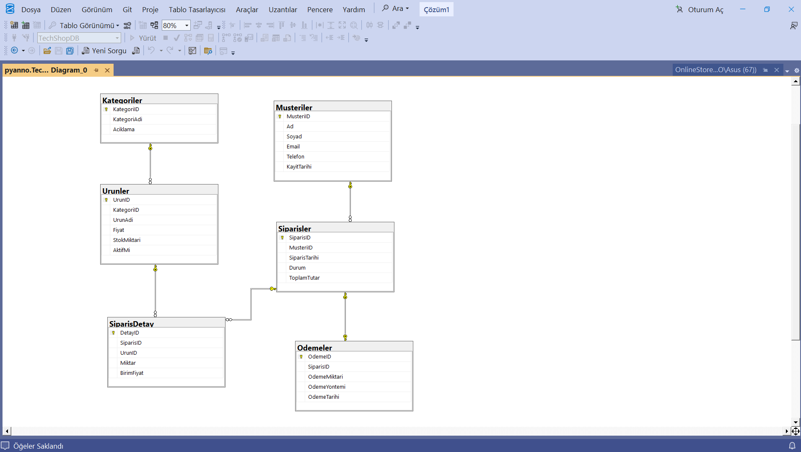

# 🛒 TechShopDB

TechShopDB is a desktop-based database management system developed using **C# Windows Forms** and **Microsoft SQL Server**.

This project was developed as part of my **Database Management Systems** coursework and demonstrates the design and implementation of a relational database integrated with a desktop application.

---

## ✨ Features

- Customer Management
- Product Management
- Category Management
- Order Management
- SQL Server Integration
- CRUD Operations (Create, Read, Update, Delete)
- SQL Views
- Stored Procedures
- SQL Triggers
- Database Backup Support
- Entity Relationship Diagram (ERD)

---

## 🛠 Tech Stack

| Technology | Description |
|------------|-------------|
| C# | Desktop Application Development |
| Windows Forms | User Interface |
| Microsoft SQL Server | Relational Database Management |
| T-SQL | Database Programming |
| Visual Studio | Development Environment |

---

## 📁 Project Structure

```text
TechShopDB
│
├── TechShopApp/                  # Windows Forms application
├── OnlineStore_VTYS_Projesi.sql  # Database creation script
├── 1.insert.sql                  # Sample data insertion
├── 2.update.sql                  # Update operations
├── 3.delete.sql                  # Delete operations
├── 4.view.sql                    # SQL Views
├── 5.sp.sql                      # Stored Procedures
├── 6.trigger.sql                 # SQL Triggers
├── TechShopDB.bak                # SQL Server backup
├── ERD.png                       # Entity Relationship Diagram
└── README.md
```

---

## 🚀 Getting Started

### 1. Database Setup

Restore `TechShopDB.bak` using **SQL Server Management Studio (SSMS)**

**or**

Execute `OnlineStore_VTYS_Projesi.sql` to create the database manually.

### 2. Run the Application

1. Open `TechShopApp.sln` in Visual Studio.
2. Update the SQL Server connection string if necessary.
3. Build and run the project.

---

## 📚 Learning Outcomes

Through this project, I gained practical experience in:

- Relational Database Design
- SQL Server Database Development
- Writing SQL Queries
- Creating Views, Stored Procedures, and Triggers
- Developing Desktop Applications with C# Windows Forms
- Integrating SQL Server with a Windows Forms Application

---

## 📸 Screenshots

### Entity Relationship Diagram



> Application screenshots will be added soon.

---

## 👩‍💻 Author
Beyan Srouji
